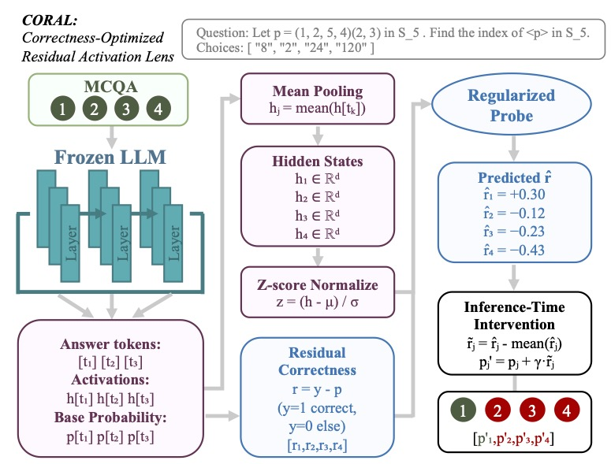

# CORAL: Correctness-Optimized Residual Activation Lens

**Transferrable and Calibration-Aware Inference-Time Steering**

[Paper](https://arxiv.org/abs/2602.06022) | [ICML 2026](https://openreview.net/forum?id=1piRnQJhLc)

Miranda Muqing Miao, Young-Min Cho, Lyle Ungar  
University of Pennsylvania

---

CORAL is a lightweight inference-time steering method that improves both accuracy and calibration in LLM multiple-choice question answering. It trains a regularized MLP probe on frozen residual stream activations to predict *residual correctness* (the gap between ideal and predicted probabilities), then uses these predictions to steer model outputs at inference time.

**Key results across three 7B-parameter models:**
- **+10% accuracy** and **-50% ECE** on in-distribution benchmarks (MMLU, RACE, CommonsenseQA)
- **+14% accuracy** and **-49% ECE** on four held-out transfer benchmarks (ARC-Challenge, HellaSwag, OpenBookQA, Math-MC), with zero retraining
- Training takes **< 5 hours** on a single RTX 2080 Ti using only cached activations

<p align="center">
  
</p>

## How It Works

1. **Collect activations:** Run a frozen LLM on MCQA questions, extracting mean-pooled residual stream hidden states per answer option.
2. **Train probe:** A weight-decay MLP probe learns to predict residual correctness r = y - p from z-score normalized activations.
3. **Steer at inference:** Predicted residuals are centered and added to base probabilities: p' = normalize(p + γ · r̃), where γ controls steering strength.

The probe directly optimizes the Brier score decomposition, jointly improving accuracy and calibration without modifying model weights.

## Installation

```bash
git clone https://github.com/mmiao2/CORAL_ICML.git
cd CORAL_ICML
pip install torch transformers datasets numpy scipy scikit-learn tqdm
```

**Tested with:** Python 3.10+, PyTorch 2.0+, Transformers 4.35+

## Quick Start

### Step 1: Collect Activations

Extract hidden states from a model on MMLU (5-shot, following lm-eval harness format):

```bash
python collect_activations_mmlu_few_shot.py \
    --model_id deepseek-ai/deepseek-llm-7b-chat \
    --dataset cais/mmlu \
    --split test \
    --layers all \
    --pool answer_mean \
    --num_fewshot 5 \
    --out_dir runs/deepseek-7b-chat-mmlu/
```

This produces `probe_data.npz` containing per-option activations, base probabilities, and residual correctness labels for all layers.

### Step 2: Train the MLP Probe

```bash
python train_mlp_probe.py \
    --features_npz runs/deepseek-7b-chat-mmlu/probe_data.npz \
    --layers 17 18 19 20 21 \
    --out_dir runs/deepseek-7b-chat-mmlu/MLP \
    --split_ids_dir runs/deepseek-7b-chat-mmlu/
```

The probe architecture (4 hidden layers: 1024, 512, 256, 128) and hyperparameters are defined in `mlp_config.py`. Training uses grid search over weight decay and output penalty, with early stopping on validation R².

### Step 3: Steer at Inference

```bash
python mlp_steer_mmlu.py \
    --model_id deepseek-ai/deepseek-llm-7b-chat \
    --dataset cais/mmlu \
    --split test \
    --probe_pkl runs/deepseek-7b-chat-mmlu/MLP/best_probe.pkl \
    --gamma 1.0 \
    --prompt_format lmeval \
    --num_fewshot 5 \
    --out_dir runs/deepseek-7b-chat-mmlu/steer_results/
```

Outputs `metrics.json` with baseline vs. steered accuracy, ECE, cwECE, Brier score, and NLL.

## Transfer Evaluation

CORAL probes transfer to new benchmarks without retraining. Use the same trained probe on a different dataset:

```bash
python mlp_steer_mmlu.py \
    --model_id deepseek-ai/deepseek-llm-7b-chat \
    --dataset allenai/ai2_arc \
    --subset ARC-Challenge \
    --split test \
    --probe_pkl runs/deepseek-7b-chat-mmlu/MLP/best_probe.pkl \
    --gamma 1.0 \
    --scoring_mode lmeval \
    --out_dir runs/deepseek-7b-chat-arc/
```

## SAE Analysis

To reproduce the sparse autoencoder ablation experiments (Section 5 of the paper):

```bash
python train_sae_unified.py \
    --data_path runs/deepseek-7b-chat-mmlu/probe_data.npz \
    --split_dir runs/deepseek-7b-chat-mmlu/ \
    --layer 19 \
    --d_sparse 16384 \
    --lambda_sparsity 0.0001 \
    --out_dir runs/deepseek-7b-chat-mmlu/SAE/
```

## Repository Structure

```
CORAL_ICML/
├── collect_activations_mmlu_few_shot.py  # Activation extraction (lm-eval harness format)
├── train_mlp_probe.py                    # MLP probe training with grid search
├── mlp_steer_mmlu.py                     # Inference-time steering evaluation
├── train_sae_unified.py                  # SAE training for ablation analysis
├── mlp_config.py                         # MLP architecture and hyperparameter config
├── sae_config.py                         # SAE architecture definition
└── util.py                               # Shared utilities
```

## Supported Models

Evaluated in the paper on:
- `deepseek-ai/deepseek-llm-7b-chat`
- `Qwen/Qwen2.5-7B-Instruct`
- `mistralai/Mistral-7B-Instruct-v0.3`

CORAL works with any HuggingFace causal LM. Set `--model_id` to your model and adjust `input_dim` in `mlp_config.py` if the hidden dimension differs from 4096.

## Citation

```bibtex
@inproceedings{
anonymous2026correctnessoptimized,
title={Correctness-Optimized Residual Activation Lens ({CORAL}): Transferrable and Calibration-Aware Inference-Time Steering},
author={Anonymous},
booktitle={Forty-third International Conference on Machine Learning},
year={2026},
url={https://openreview.net/forum?id=1piRnQJhLc}
}
```

## License

MIT
